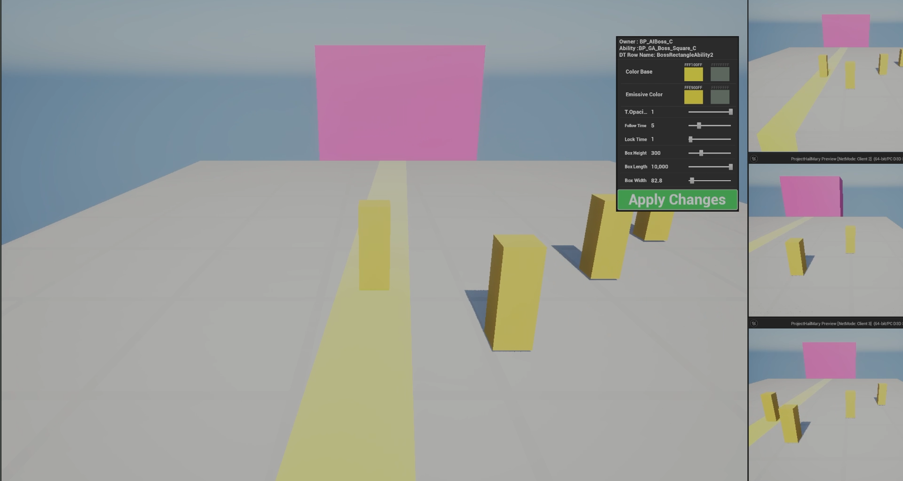
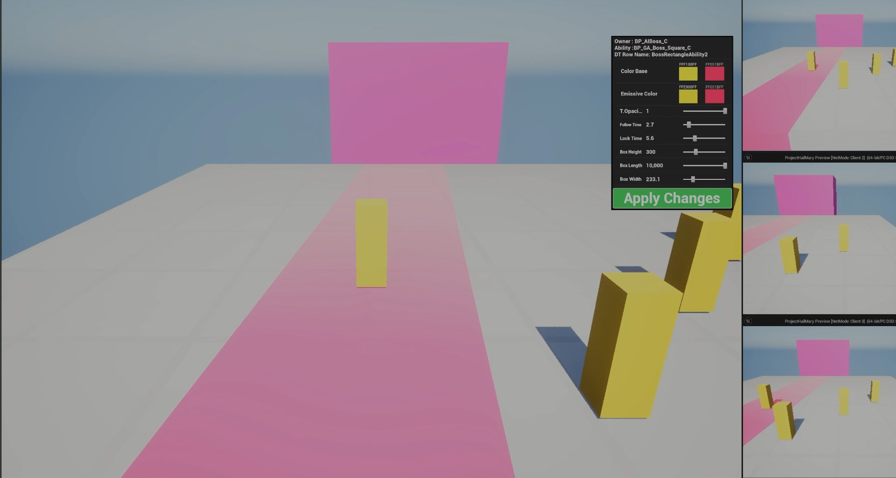
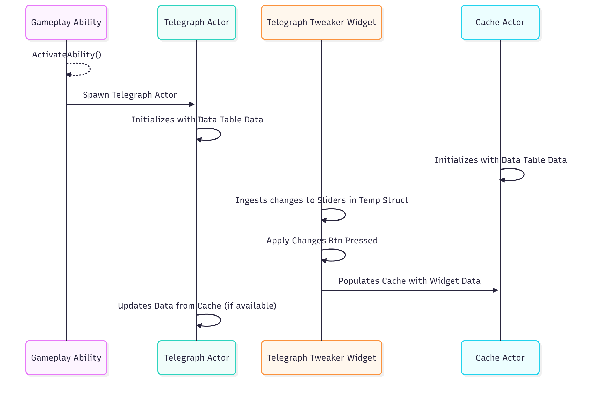

# Runtime Ability Telegraph Editor

### Goals
1. Increase Encounter Iteration Speed.
2. Provide productivity tools to Game Designers.
3. No-code Ability Telegraph Editing at Runtime.

## Why this works
1. This system provides Game Designers an easy way to quickly run the game in editor and edit any telegraphed abilities data.
2. Game Designers don't need to code anything at all, they simply iterate by adjusting exposed data on the widget.
3. When the Game Designer approves the data, they populate a Data Table with a new Row with the new data and its ready for Prod or more iteration.
4. Widget is simply expanded to take as many data inputs as desired.

## Demo Video

  <iframe width="560" height="315" src="https://www.youtube.com/embed/c2jaswpKoiY?si=OaaEiiTo4wlYo_WX" title="YouTube video player" frameborder="0" allow="accelerometer; autoplay; clipboard-write; encrypted-media; gyroscope; picture-in-picture; web-share" referrerpolicy="strict-origin-when-cross-origin" allowfullscreen></iframe>

## In Game Screenshots

- Works in networked environments so multiple designers can iterate together.
- Ties in cleanly with the popular Gameplay Ability System.
- Light weight and uses already available data.

- Any Data Point can be exposed to or hidden from the widget.
- Widget is easily editable and is made of multiple smaller widgets per data type.

## Code Map
<!-- blank line above! -->

| Class                                 | Role                                                              | Key Methods                                                                                                 | GitHub                                                                                                                                                                                                                                                       |
|---------------------------------------|-------------------------------------------------------------------|-------------------------------------------------------------------------------------------------------------|--------------------------------------------------------------------------------------------------------------------------------------------------------------------------------------------------------------------------------------------------------------|
|`HmAbilityTelegraphTweaker` (UI Widget for Adjusting Data) |Handle updating of values on Cache, Creation of Child widgets per data type.| `CreateWidgetsFromDataTable()` `UpdateCacheActorStruct()` `PackageData_Float()` `PackageData_Color()` | [H](https://github.com/unrealrobin/ProjectHailMary/blob/main/Source/ProjectHailMary/Public/UI/Widgets/HmAbilityTelegraphTweaker.h) - [CPP](https://github.com/unrealrobin/ProjectHailMary/blob/main/Source/ProjectHailMary/Private/UI/Widgets/HmAbilityTelegraphTweaker.cpp) |
| `AbilityTelegraphData` (Data Struct)  | Holds Data used by Telegraph Actor                        |  | [H](https://github.com/unrealrobin/ProjectHailMary/blob/main/Source/ProjectHailMary/Public/Types/BossAbilityTelegraphData.h)                |
| `HmAbilityTelegraphBase` (Telegraph Actor) | Spawned by ability for telegraphing | `UpdateDynamicMaterialInstance_Server()` `UpdateDynamicMaterialInstance_Client()` | [H](https://github.com/unrealrobin/ProjectHailMary/blob/main/Source/ProjectHailMary/Public/Telepgraph/HmAbilityTelegraphBase.h) - [CPP](https://github.com/unrealrobin/ProjectHailMary/blob/main/Source/ProjectHailMary/Private/Telepgraph/HmAbilityTelegraphBase.cpp)|
| `HmTelegraphCache_Rep` (Cache Actor) | Provides a cache of adjustable data for abilities to read from | Simple Cache of Data | [H](https://github.com/unrealrobin/ProjectHailMary/blob/main/Source/ProjectHailMary/Public/Telepgraph/DevelopmentOnly/HmTelegraphCache_Rep.h) - [CPP](https://github.com/unrealrobin/ProjectHailMary/blob/main/Source/ProjectHailMary/Private/Telepgraph/DevelopmentOnly/HmTelegraphCache_Rep.cpp) |
---

# Architecture

1. The Cache actor is placed in level during development of Telegraphed Abilities.
2. The actor initializes on the Data Table with predefined Telegraph Data.
3. The Designer can then make a change on the widget to exposed Data and Apply Changes.
4. Changes then update the Cached Actors Struct.
5. On Subsequence spawns of a telegraph actor, it will use data from the cache.
6. Changes are visible in multiplayer environments.

[View Full Repo on GitHub](https://github.com/unrealrobin/ProjectHailMary)

#

**Email:** robin@paracosm.gg
**LinkedIn:** [https://www.linkedin.com/in/robinlifshitz/](https://www.linkedin.com/in/robinlifshitz/)
**Location:** Los Angeles, Ca
