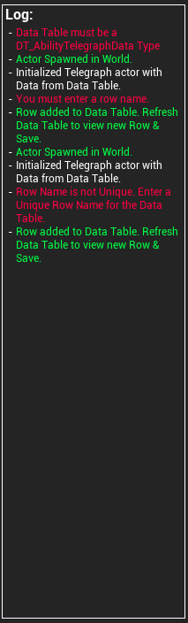
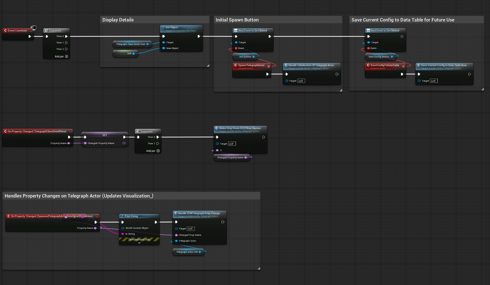
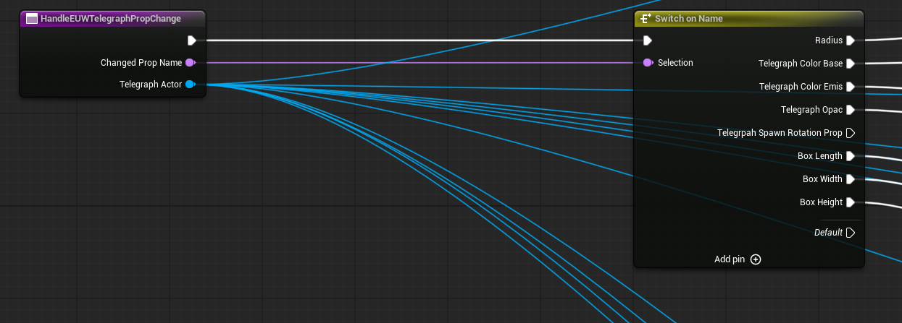
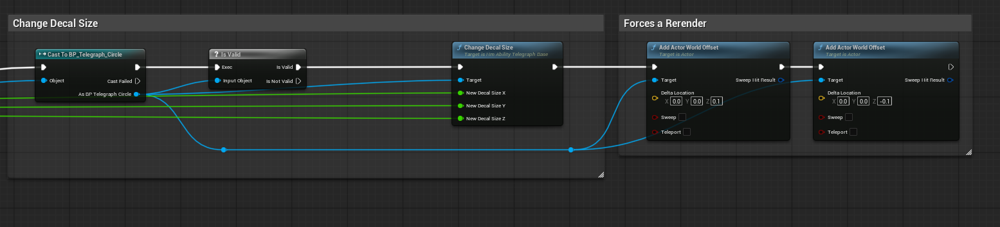

# Editor Utility Widget - Ability Telegraph Editor

You can also view a simpler runtime version of this idea here: [Runtime Ability Editor](./Portfolio/AbilityTelegraphEditor.md)

## Goals

1. Increase Encounter Iteration Speed.
2. Provide a simple and safe way to edit Ability Telegraph Data.
3. No-code Ability Telegraph Editing at Runtime.
4. Update Data Table without needing to enter data points.
5. No Runtime Overhead, and no gameplay logic adjustments.

## Why this works

1. Designers want a simple and intuitive tool to help them quickly iterate on the visuals and timings of telegraphs, this tool provides a simple approach to doing just that.
2. Game Designers don't need to code anything at all, they simply iterate by adjusting exposed data on the widget. 
3. The editor utility widget allows the designer to view changes in real time, modifications are done directly to a spawned instance of the telegraph and data can be saved for further use/iteration.
4. Widget can be easily expanded to add additional data slots like telegraph material selection.

## Demo Video

  <iframe width="560" height="315" src="https://www.youtube.com/embed/V91LgtBTyb8?si=bbqX5WCo8Ji5caET" title="YouTube video player" frameborder="0" allow="accelerometer; autoplay; clipboard-write; encrypted-media; gyroscope; picture-in-picture; web-share" referrerpolicy="strict-origin-when-cross-origin" allowfullscreen></iframe>

## In Game Screenshots

The widget has a simple step by step process that is clear and easy to understand.

The widget logs any issues or successes so designers know if they missed a step or need to adjust any of their entries.

- Works in networked environments so multiple designers can iterate together.
- Ties in cleanly with the popular Gameplay Ability System.
- Light weight and uses already available data.

## Code Map

All work was done in Blueprints. The following images show some of the scripts.

### Main Editor Utility Widget Functions.

1. Creation
2. Updates
3. Saves

### Changes are handled through Property Listeners

### Change is handled per property type.

[View Full Repo on GitHub](https://github.com/unrealrobin/ProjectHailMary)

---
**Email:** robin@paracosm.gg
**LinkedIn:** [https://www.linkedin.com/in/robinlifshitz/](https://www.linkedin.com/in/robinlifshitz/)
**Location:** Los Angeles, Ca